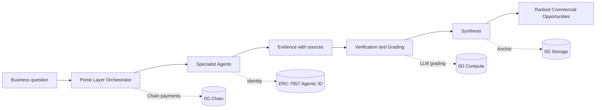
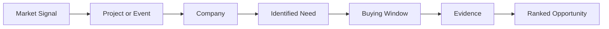

# Prime Layer

**Search finds information. Lead databases find contacts. Prime Layer investigates demand.**

Prime Layer is a B2B demand-intelligence network. Businesses describe what they need to move in plain language and the network investigates where commercial demand is forming, why it exists, who is involved, when the buying window is, and what evidence proves it.

## The problem it solves

Businesses often have significant inventory or capacity they need to move, but the companies that will eventually need it are not searchable as buyers.

A company with $500k of electrical appliances will not find its buyers by searching for electrical equipment buyers. The buyers are not looking for electrical equipment yet. They are building a hotel, expanding a factory, fitting out a hospital, or starting an infrastructure project. The demand exists because an event created it.

Search engines return pages. Lead databases return companies and contacts. Neither answers the questions that matter commercially:

- where demand is forming
- what event created the demand
- who is involved
- when the purchase is likely to happen
- what the company may need
- how strong the evidence is

Prime Layer takes a natural language request such as

> I have $500k of electrical appliances. Find companies likely to need them.

and investigates the market behind it. It looks for situations that create demand for those appliances - new facilities, expansions, construction, refurbishment, procurement - and turns what it finds into ranked opportunities with reasoning and verifiable sources. The goal is not more results. It is a short set of opportunities a business can act on.

## How we built it

Prime Layer is an intelligence network, not a search box. One orchestrator directs ten specialist agents. The system generates hypotheses before anyone searches, investigates in parallel, and synthesizes what comes back into one recommendation per company.

The flow is:

**Question → demand hypotheses → specialist investigation → signals → evidence → verification → commercial intent → ranked opportunities**

### Demand hypotheses

Before any agent searches, the orchestrator generates 3 to 5 demand hypotheses about what situations could create demand for the inventory in question. The system searches for the circumstances that create demand rather than searching for the inventory itself.

Buyer has X, who uses X at volume, what event triggers buying X, where would that event be reported. That chain drives the investigation and adapts to whatever the business sells, not a fixed product category.

### Specialist agents

Each agent is bounded to a type of intelligence. Together they cover different surfaces of the market:

- **Web Research** - general web and news investigation
- **Social Signal** - public statements that indicate commercial intent
- **Project Intel** - construction, infrastructure and development projects
- **Company Intel** - organizations and their activities
- **Person/Role Intel** - public professional roles and relationships
- **Procurement** - tenders, contracts and purchasing activity
- **Media / YouTube** - interviews, tours and audiovisual sources, with transcript extraction and project parsing
- **Verification** - independent verification of important claims
- **Synthesis** - connecting evidence into coherent hypotheses
- **Prime Signals** - first-party connector covering Google News RSS, GDELT and SEC EDGAR filings

The orchestrator assigns work. Agents return structured claims. The orchestrator decides what becomes an opportunity, what needs verification, and what triggers further investigation.

### Evidence

Every meaningful claim carries evidence and a source. The system keeps a clear boundary between what a source confirms and what the system infers from it. A source date, URL and observed item support each claim, and the readout shows both the fact and the inference so the reader can follow the reasoning.

### Duplicate evidence

Five agents citing the same article count as one source, not five independent confirmations. Source clustering canonicalizes URLs and groups citations of the same underlying document into a single cluster. Independent sources increase confidence. Repeated citations do not.

### Recursive investigation

A discovery can trigger controlled follow-up investigation. Finding that a contractor is delivering electrical works for a hotel, for example, can lead to an investigation of that contractor, the procurement status, the project stage, or related entities. Recursion is bounded by depth, source count and token budget to avoid uncontrolled traversal and is terminated on diminishing returns or duplicate detection.

### Commercial synthesis

The final output is not hundreds of search results. It is a ranked set of opportunities, each with company, identified need, timing, confidence, reasoning, evidence and relevant sources. Synthesis is guided by `soul.md`, merges multiple signals about the same company into one recommendation, and distinguishes confirmed facts from probable inference. The purpose is to give a business something it can act on and verify.

## Technologies I used

Application and infrastructure:

- SvelteKit
- TypeScript
- Vite
- Bun
- Vercel
- AWS EC2
- Turso libSQL
- Drizzle ORM
- Tailwind
- Radix
- TanStack Router

Intelligence:

- Google News RSS
- GDELT
- SEC EDGAR
- YouTube Data API
- YouTube timedtext transcripts
- Custom scoring and clustering
- Evidence graph
- Demand hypothesis generation
- Recursive investigation
- `soul.md` synthesis

Web3 / 0G:

- 0G Chain - payments and contributor settlement
- 0G Storage - evidence, readout and settlement anchoring
- 0G Compute - LLM grading
- ERC-7857 Agentic ID - identity for participating agents
- ethers
- Privy

0G Chain handles per-run buyer payments and weighted settlement to contributing agents. 0G Compute provides the LLM grading pass that judges relevance and evidence quality alongside deterministic scoring. 0G Storage provides permanent anchoring of evidence records, readouts and settlements with a verifiable root. ERC-7857 gives each grid agent an on-chain identity at registration.

## Challenges we ran into

### Reliable intelligence from multiple agents

A distributed network can generate more data without generating better intelligence. We addressed this through specialization, structured claims, orchestration and verification. Each agent is responsible for one surface, returns evidence in a common claim shape, and the orchestrator decides what advances, what is verified, and what is synthesized.

### Duplicate sources

Multiple agents can independently find the same article and report it as separate evidence. Without handling, that inflates confidence. Source clustering canonicalizes sources and groups citations of the same document into one cluster so confidence grows only with genuinely independent corroboration.

### Grounded recommendations

Early outputs could produce generic reasoning or misclassify entities. We tightened entity classification and filtering and made synthesis depend on the specific signal reported, so each recommendation explains the actual event, the company behind it, and why it matters for the inventory in question.

### Depth vs speed

Ten specialists need time to investigate independently, but the system must remain practical. Parallel research and bounded recursive investigation keep depth without open-ended cost. Depth, source count and token budget are capped and follow-up rounds run only when evidence is thin or confidence is low.

### Different evidence types

News, regulatory filings, project information, procurement activity, social signals, company activity, people and video each provide evidence in a different form. A common claim and evidence structure allows them to be evaluated and synthesized together rather than treated as separate result types.

## What we learned

### Investigation beats search

Starting from the situations that create demand produces stronger intelligence than searching directly for the product. Framing the problem around events - new sites, expansions, refurbishments, tenders - finds opportunities that keyword matching misses.

### Independent evidence matters more than volume

Repeated citations are not independent corroboration. Confidence should increase with genuinely independent sources that support the same conclusion, not with the number of times one source is reported.

### Commercial context matters

A signal becomes commercially meaningful when combined with project stage, scale, timing, ownership, contractors, procurement status and related entities. Context turns a mention into an opportunity.

### Facts and inference must remain separate

The system needs to show what a source confirms and what the system concludes from that evidence as two distinct things. Keeping that boundary clear makes the output verifiable and the reasoning inspectable.

### Intelligence compounds

As the system accumulates entities, relationships, events and evidence, it can form a broader picture of emerging demand rather than treating every request as an isolated query. The evidence graph makes that accumulation useful over time.

## What's next

- Expanding the agent network beyond the current ten specialists and adding more independent contributors
- Broader sources including trade publications, procurement portals and industry registries
- Per-user Evidence that distinguishes a user's intelligence from network-wide intelligence
- A richer Demand Graph around Company to Event to Need to Timing relationships
- Better contradiction handling
- Better source authority and recency weighting
- Stronger relevance filtering
- Hardening agent payouts and Agentic ID for mainnet-scale operation

Long term, Prime Layer should become the place a business goes when it needs to move something and wants to know who needs it, why they need it, when they will need it, and what proves it. That is the direction the network is being built toward.

## Status

Prime Layer runs end to end today:

- Natural language requests through the workspace with demand hypothesis generation
- Ten first-party specialist agents investigating in parallel
- Structured claims with evidence and sources
- Source clustering and deduplication
- Deterministic grading and LLM grading through 0G Compute with fallback
- Bounded recursive follow-up investigation
- Evidence graph with entities and relationships
- Synthesis into one recommendation per company guided by `soul.md`
- Buyer payments with contributor settlement weighted by contribution
- 0G Storage anchoring of evidence, readouts and settlements
- ERC-7857 Agentic ID for participating agents

Current product limitations are per-user Evidence scoping and network breadth. Both improve as more specialists and independent contributors join the grid.

## Built by Prime Isles

Prime Isles is an independent engineering team focused on AI, autonomous agents, Web3, developer infrastructure, and building systems that turn complex information into useful action.
